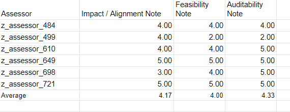

# Littlefish Foundation Weekly Meeting - 2021-12-20

## Agenda
1. Welcome & Catalyst results talk 
2. Emre will propose an alternative path for Littlefish Foundation: An ultimately generic and open-source DAO framework to handle loans, donations and support transactions
3. Whitepaper 
4. Discuss social engagement 
5. Select moderator for weekly meeetings 
6. Set Project Management Tool 
7. Discuss Subgroups 

## Attendees
1. Cem Karaca
2. Çağkan Acarbay
3. Özgür Akyar
4. Yoram Ben Zvi
5. Mert Akyazı
6. Seomon Bulb
7. Emre Öktem
8. Sebastian Pereira Gutierrez
9. Nori Nishigaya

## Meeting Notes

Catalyst CA voting results were discussed. We decided to flag this assessment: z_assessor_499. The assessment can be found here: https://cardanocataly.st/proposal-review-tool/#/assessments/2892 (link provided by Yoram). Assessments can be flagged through this form: https://docs.google.com/forms/d/e/1FAIpQLSc0u8LTzDPRdIQ8iDtys7SVsMhOPuDbMEc1HT6Y3Mtwq5CDsA/viewform

Emre presented an alternative framework for Littlefish focusing on establishing standards that can be generalized. These standards would include loans, donations and other transfer types with multiple sources funding a single target. The model encompasses all web2 alternatives we have discussed in the past: Kiva, change.org, kickstarter. With this model, Littlefish would not be limited to SDG based issues. But SDG issues may be the starting point as a POC of the broader model. You can check out the entire presentation by watching the meeeting on youtube: https://www.youtube.com/watch?v=aRaymqBy_JY

Yoram: Focus on a cause is very important. Our focus is on transparency of funds going to the ground.

Nori noted building up credibility and validation are the most important things. We should unlearn agile systems and stick to a cause.

We discussed briefly the social aspects, governance, usage patterns, gamification.

Slide 8 of Gimbalabs DAO presentation is shown by Nori to summarize what it means to be a DAO: https://docs.google.com/presentation/d/1l960VFMDUW4BM7ckJuFFW2T0ewgCKITnfFU-ysGzED8/edit#slide=id.gfb756f572d_2_4

We discussed and set short term targets regarding the first donation cycle. 

## Outcomes

An announcement one-pager will be prepared to explain the first donation process to the community. The announcement will also describe how to donate to the treasury wallet. For the first donation, a hard cap of 1000 ADA will be implemented. All donations above will be kept in treasury for the next round. 

Following the donations, a single proposal from the community will be selected based on a vote. A maximum of 1000 ADA will then be donated to the winning proposal. 

We set some tentative deadlines regarding the donation process:

- On the 1st of January we’ll have the one-pager ready and announce to the community. We’ll initiate discussions among the community to decide which proposal to donate to.
- On the 10th of January, we’ll have the vote - We will prepare a basic voting mechanism for this (most likely Google Forms)

A proof of activity regulations manual will need to be prepared. This manual should include the rules and further steps for the donatee to provide evidence of their activities. (such as twitter posts)

## Developments

- Nori created $littlefish token: https://pool.pm/f0ff48bbb7bbe9d59a40f1ce90e9e9d0ff5002ec48f232b49ca0fb9a.littlefish   
- Youtube channel created: https://www.youtube.com/channel/UCqST3YotsWuc0faaqsLjdKQ
- New channels on Discord: votings and Proposals and Social Aspects
- All members added to Github. Meeting notes will be present on the Github site. https://github.com/orgs/littlefish-foundation
- Full meeting can be seen from the link: https://www.youtube.com/watch?v=aRaymqBy_JY

## To Do

- Flag z_assessor_499 via https://cardanocataly.st/proposal-review-tool/#/assessments/2892
- Treasury Wallet will be created.
- Move $littlefish token adress to treasury wallet
- Breakout rooms Social and Technical will be created in zoom meetings. 
- Prepare announcement one pager will be
- Form for accepting proposals
- Form for voting
- Proposal requisites and Vote mechanisms will be discussed in relevant Discord channels. These topics will be in the agenda for the next week to discuss.

## Zoom Chat Transcript

22:07:21 From  yorambenzvi  to  Everyone:

	https://cardanocataly.st/proposal-review-tool/#/assessments/2892

22:08:48 From  yorambenzvi  to  Everyone:

	https://docs.google.com/forms/d/e/1FAIpQLSc0u8LTzDPRdIQ8iDtys7SVsMhOPuDbMEc1HT6Y3Mtwq5CDsA/viewform

22:59:05 From  Mert Akyazı  to  Everyone:

	poldakot

23:00:04 From  Nori Nishigaya  to  Everyone:

	See slide #8 here:l https://docs.google.com/presentation/d/1l960VFMDUW4BM7ckJuFFW2T0ewgCKITnfFU-ysGzED8/edit#slide=id.gfb756f572d_2_4

23:15:31 From  Mert Akyazı  to  Everyone:

	https://github.com/ethereum/remix/blob/master/remix-analyzer/test/analysis/test-contracts/solidity-v0.5/ballot.sol

23:15:37 From  Nori Nishigaya  to  Everyone:

	https://pool.pm/f0ff48bbb7bbe9d59a40f1ce90e9e9d0ff5002ec48f232b49ca0fb9a.littlefish

23:20:15 From  Nori Nishigaya  to  Everyone:

	We could use something like https://www.chainvote.co/ to do the voting itself which is Tevo’s blockchain voting project.

23:24:28 From  Nori Nishigaya  to  Everyone:

	Or start on Etherium as a DAO and use something like https://aragon.org/ and move to cardano once it’s ready.

23:28:10 From  Seomon  to  Everyone:

	Seomon4u

23:28:15 From  Mert Akyazı  to  Everyone:

	ClockchainXD

23:28:16 From  Nori Nishigaya  to  Everyone:

	Github: Xeeban

23:28:24 From  cagkan  to  Everyone:

	cagkanacarbay

23:28:33 From  Mert Akyazı  to  Everyone:

	ClockChainXD

23:29:03 From  Emre Oktem  to  Everyone:

	Github: emreoktem

23:29:32 From  yorambenzvi  to  Everyone:

	yogo2000

23:35:34 From  yorambenzvi  to  Everyone:

	yoram@connectality.com

23:44:55 From  Cem Karaca  to  Everyone:

	data Person1 = Person1 {fistName::String,lastName::String, age::Int, phoneNumber::String} deriving(Show)

23:45:22 From  Cem Karaca  to  Everyone:

	let sat = Person1 "cem" "karaca" 43 "532"

	*Main> sat

	Person1 {fistName = "cem", lastName = "karaca", age = 43, phoneNumber = "532"}
